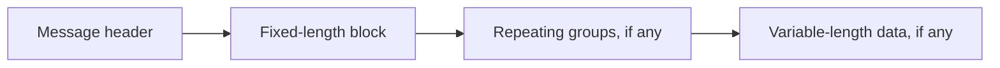

# How an SBE message is laid out

An SBE message follows a layout defined by its schema. The schema tells
readers where fields sit and how to read the variable-length parts. Field
names and field IDs are not repeated in each encoded message.

The parts appear in this order:



sbe-buddy maps this structure to record components. Consider
`BasketOrder.java`, in a package declared with
`@SbeSchema(id = 100, version = 0)`:

```java
package com.example.trading;

import java.util.List;

import net.concini.sbebuddy.SbeData;
import net.concini.sbebuddy.SbeField;
import net.concini.sbebuddy.SbeGroup;
import net.concini.sbebuddy.SbeMessage;
import net.concini.sbebuddy.VarStringEncoding;

@SbeMessage(id = 2)
public record BasketOrder(
        @SbeField(id = 1) long orderId,
        @SbeGroup(id = 2) List<Leg> legs,
        @SbeData(id = 5, type = VarStringEncoding.class) String note) {

    public record Leg(
            @SbeField(id = 3) long instrumentId,
            @SbeField(id = 4) int quantity) {}
}
```

The record holds the application values. The generated `BasketOrderCodec`
reads and writes the headers and lengths needed to encode them.

## The message header identifies the layout

The standard SBE header contains four values: block length, template ID,
schema ID and schema version. Each is a `uint16`, making the header eight
bytes long.

For `BasketOrder`, the template ID is 2 and the schema ID is 100. The
version tells a reader which version of the schema the writer used. The
block length tells it how many bytes the message's fixed-length block
occupies.

sbe-buddy uses `DefaultMessageHeader` unless the schema selects a custom
header through `@SbeSchema.headerType`. The header is separate from the
message record's components. The codec writes it on encode and reads it
on decode.

## The fixed-length block holds fields

`@SbeField` components occupy the fixed-length block. In this example,
`orderId` is an `int64`, so the block is eight bytes long. The list and the
note follow it and do not contribute to its block length.

Fields can also use enums, sets, composites, fixed-length strings and
arrays. Their encodings have sizes known from the schema. A constant
occupies no bytes; an optional scalar still occupies its full width and
uses a reserved value to represent absence. Explicit offsets and block
lengths can leave padding in the block.

Record component order determines wire order unless a `layout` declaration
specifies it explicitly. Fields must come before groups, and groups before
variable-length data. Field IDs identify declarations; they do not select
byte offsets.

## A repeating group contains entries

`@SbeGroup` maps a repeating group to a `List` of entry records. Here, each
`Leg` has a twelve-byte fixed block: eight bytes for `instrumentId` and four
for `quantity`.

The group begins with a dimension header containing the entry block length
and the number of entries. The default `GroupSizeEncoding` uses two
`uint16` values, so that header occupies four bytes. It appears once for
the group, followed by its entries. Entries do not have individual message
headers.

Each entry follows the same body structure as a message: its fixed fields,
then any nested groups, then any variable-length data. The next entry starts
after all of those parts. A dimension header's block length counts only the
fixed part of one entry, so it is not necessarily the entry's total size.

An empty list still writes the dimension header, with an entry count of zero.

## Variable-length data has a length prefix

`@SbeData` maps an SBE `data` member to a `String` for text or a `byte[]`
for binary data. Each member has a length prefix followed by its payload.
The prefix counts payload bytes, not characters, and excludes its own size.

The `note` uses `VarStringEncoding`: a two-byte `uint16` length followed by
UTF-8 bytes. The string `"buy"` needs three payload bytes, so the whole data
member occupies five bytes. An empty string still writes the length prefix,
with a value of zero.

Because the preceding groups can vary in size, the note has no single fixed
offset from the start of the message. Readers reach it by traversing the
groups first.

## Block length and message length are different

A `BasketOrder` with two legs and the note `"buy"` has this layout:

| Part | Bytes |
| --- | ---: |
| Standard message header | 8 |
| Message's fixed block: `orderId` | 8 |
| Group dimension header: entry block length 12, entry count 2 | 4 |
| Two leg entries | 24 |
| Note length prefix | 2 |
| Note payload | 3 |
| **Total** | **49** |

The message header's block length is **8**, while
`codec.encodedLength(order)` and a successful `codec.encode(...)` return
**49**, including the header and every variable-length part. The standard
header does not carry the total message length. Transport framing, when
needed, is separate from this SBE layout.

This distinction also explains how an older reader can skip fields appended
to a fixed block, but cannot automatically skip an unfamiliar group. See
[Schema versions and absence](schema-versions-and-absence.md) for how the
layout affects compatibility.

For declaration details, see [Fields](../reference/fields.md),
[Repeating groups](../reference/groups.md) and
[Variable-length data](../reference/variable-length-data.md).
